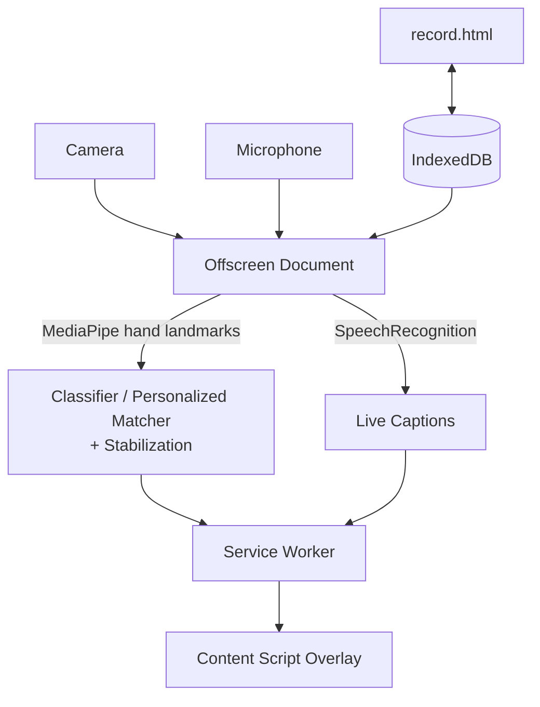

# SignSync

SignSync is a privacy-first Chrome extension that brings live captions, camera-based sign-gesture recognition, and personalized gesture-to-speech to any browser tab — entirely on-device, with no backend server. It layers a floating accessibility overlay on top of whatever page you're using (a video call, a lecture stream, anything), recognizing hand gestures via MediaPipe running locally in the browser and turning them into text and speech in English, Hindi, or Telugu.

## Features

- **Live captions** — real-time speech-to-text via the browser's Web Speech API, in English/Hindi/Telugu, with friendly handling of unsupported languages, denied microphone access, or an unsupported browser.
- **Sign → Text / Sign → Speech** — a small built-in vocabulary of hand gestures, recognized locally via MediaPipe hand-landmark detection and a deterministic geometric classifier, converted to on-screen text and spoken aloud.
- **Personalized gestures** — record your own hand gestures with your own meanings (with optional Hindi/Telugu translations), stored locally in IndexedDB, and recognized live using a rotation-invariant nearest-neighbor matcher.
- **Multilingual interface** — English, Hindi, and Telugu throughout the popup, overlay, and every extension page, with automated tests enforcing full translation-key parity.
- **Learn Sign Language hub** — a region (ISL/ASL) and category browsing structure, honestly showing "coming soon" rather than fabricated sign definitions until a licensed content source is integrated (see [Limitations](#limitations)).
- **Accessibility controls** — high contrast, larger text, and reduced motion, applied consistently across every page.
- **Conversation history** — a session-only log of recent gesture and caption events in the overlay.
- **Local-first architecture** — camera frames and hand landmarks never leave the browser; personalized gesture data lives in IndexedDB on your machine; there is no backend server.

## Demo

No public demo is hosted. To try it locally, see [Getting Started](#getting-started) below — it takes about a minute to build and load as an unpacked extension.

## Tech Stack

**Frontend**
- React 18 + TypeScript
- Vite (eight separate build configs, one per MV3 entry point)
- Tailwind CSS

**AI / Computer Vision**
- [`@mediapipe/tasks-vision`](https://www.npmjs.com/package/@mediapipe/tasks-vision) — on-device hand-landmark detection (21 points/hand)
- A deterministic, rule-based gesture classifier (no training, fully inspectable) for built-in gestures
- A rotation-invariant nearest-neighbor matcher for user-recorded personalized gestures

**Platform**
- Chrome Extension Manifest V3
- Offscreen Documents (camera + MediaPipe + SpeechRecognition)
- Content Scripts + a floating overlay
- Service Worker (state + message relay)

**Storage**
- IndexedDB (personalized gestures and their recorded examples)
- `chrome.storage.local` (settings)

**Testing**
- Vitest, TypeScript's `tsc --noEmit`, ESLint

Only technologies actually present in `package.json` and the source tree are listed here.

## Architecture



Full explanation of every surface, why MediaPipe runs in an offscreen document rather than the content script, how personalized gestures flow from recording to live recognition, and how multilingual support stays entirely out of the recognition pipeline: **[`docs/architecture.md`](docs/architecture.md)**. Key individual decisions are recorded as ADRs in **[`docs/decisions/`](docs/decisions/)**.

## Privacy

- Camera frames and hand landmarks are processed **entirely on-device**, inside the extension's offscreen document — they are never transmitted anywhere.
- Personalized gesture data is stored **locally**, in IndexedDB, and never leaves the device.
- There is **no backend server** — a repository-wide search confirms zero network calls (`fetch`/`XHR`) exist anywhere in the source.
- Live captions run through the browser's own `SpeechRecognition` API — depending on Chrome's implementation, this *may* process audio through a Google speech service rather than fully on-device, which is standard Web Speech API behavior across browsers, not something SignSync configures or controls.
- Camera and microphone access are requested only for the features that need them, through Chrome's standard permission prompts.

Full detail: **[`PRIVACY.md`](PRIVACY.md)**.

## Getting Started

```bash
cd extension
npm install
npm test              # run the automated test suite
npm run typecheck      # tsc --noEmit
npm run lint            # eslint
npm run build            # produces extension/dist/
```

Then load it in Chrome:

1. Open `chrome://extensions`
2. Enable **Developer mode** (top right)
3. Click **Load unpacked**
4. Select `extension/dist`

The extension icon should appear in the toolbar. See **[`docs/manual-test-plan.md`](docs/manual-test-plan.md)** for a full manual walkthrough of every feature.

## Project Structure

```
SignSync/
├── docs/                          architecture, ADRs, testing strategy, manual QA plan
│   ├── architecture.md
│   ├── decisions/                 architectural decision records
│   ├── product-requirements.md
│   ├── technical-specification.md
│   ├── testing.md
│   ├── manual-test-plan.md
│   └── release-checklist.md
├── extension/
│   ├── src/
│   │   ├── ai/                    gesture classification, personalized matching, stabilization
│   │   ├── background/            service worker: state + message relay
│   │   ├── content/                overlay UI, injected into every page
│   │   ├── offscreen/               camera, MediaPipe, SpeechRecognition
│   │   ├── popup/                    Dashboard, Onboarding, Settings
│   │   ├── record/                    the personalized-gesture recording wizard
│   │   ├── validate/                  reviewing/testing saved personalized gestures
│   │   ├── tutorials/                  the Learn Sign Language hub
│   │   ├── permission/                 the visible camera/mic permission tab
│   │   ├── services/                    IndexedDB + chrome.storage access
│   │   ├── shared/                       pure logic shared across contexts
│   │   ├── i18n/                          English/Hindi/Telugu translation catalogs
│   │   └── types/                          the shared cross-context message/state types
│   ├── public/                    manifest, icons, bundled MediaPipe WASM + model
│   └── real-data/                 optional real-webcam test fixtures (gitignored)
├── CONTRIBUTING.md
├── SECURITY.md
└── PRIVACY.md
```

## Testing

Run `npm test` (from `extension/`) to execute the full Vitest suite — treat the exact count as a moving target and check the test runner's own output for the current, authoritative number rather than a number hardcoded here. See **[`docs/testing.md`](docs/testing.md)** for what's covered, what isn't, and why component-level UI logic is deliberately extracted into plain, unit-tested functions.

## Engineering Highlights

- **MV3 offscreen processing** — camera capture and MediaPipe inference run in a dedicated offscreen document rather than the content script, so raw camera frames never touch an arbitrary web page's context, and one camera stream serves every tab regardless of which one has focus. ([ADR 001](docs/decisions/001-offscreen-mediapipe.md))
- **Two fully independent gesture-recognition paths** on the same frame — a deterministic built-in classifier and a rotation-invariant personalized-gesture matcher — that never call into or influence each other.
- **Temporal stabilization** that emits an event only on a genuine transition into a new stable gesture, never once per matching frame, so speech output can't spam the same word repeatedly while a gesture is held. ([ADR 004](docs/decisions/004-gesture-stabilization.md))
- **IndexedDB with a resilient loader**: a failed refresh never clears a previously-successful gesture list, and the live per-frame detection loop never performs an IndexedDB read of its own — only a synchronous, pre-fetched snapshot. ([ADR 003](docs/decisions/003-indexeddb-personalized-gestures.md))
- **Multilingual support kept entirely out of the recognition pipeline** — the AI code never receives, stores, or reasons about a language setting; localization happens strictly at the presentation layer. ([ADR 005](docs/decisions/005-multilingual-presentation-layer.md))
- **A single typed message union** for every cross-context event, with the service worker as the required relay (content scripts can't be reached from an offscreen document directly). ([ADR 006](docs/decisions/006-mv3-message-pipeline.md))
- **Structured, gated diagnostics** — verbose developer logging exists for the personalized-gesture pipeline, but never leaks into user-facing UI; ordinary users see plain-language error messages, never raw `DOMException` names or SpeechRecognition error codes.
- **Defensive storage handling** — a single malformed stored gesture record is dropped individually, never allowed to break an entire read; legacy-format migration is idempotent and tested for partial-failure recovery.
- **Accessibility applied consistently, not decoratively** — high contrast, larger text, and reduced motion settings are wired through a single shared helper applied identically across five separate pages, rather than five independent implementations.
- **Local-first by architecture, not by accident** — no backend exists, and a repository-wide search rather than a design-doc claim is what backs that statement.

## Limitations

Stated honestly, not minimized:

- **Tutorial content is currently empty.** The Learn Sign Language hub's data model and UI are fully built, but no actual ASL/ISL sign definitions are included — the team deliberately chose not to fabricate sign-language content without a licensed, verified source. This is a content-sourcing decision, not an engineering gap.
- **Live browser behavior is not fully verified.** Automated tests cover the recognition math, storage, and localization logic in isolation; real camera accuracy, real SpeechRecognition language support, and real permission flows need to be confirmed by hand — see `docs/manual-test-plan.md`.
- **`SpeechRecognition` support varies by browser/OS/Chrome version.** SignSync surfaces this gracefully (a plain-language "not available for this language" message) rather than failing silently, but it can't make a browser support a language it doesn't.
- **Recognition accuracy depends on camera and environment** — lighting, camera quality, and hand positioning all affect real-world MediaPipe landmark quality, independent of anything SignSync's own code controls.
- **No formal accessibility audit.** Semantic HTML, ARIA attributes, and keyboard-navigable controls are used throughout, but no screen-reader walkthrough or WCAG compliance review has been performed.
- **Translations are AI-assisted, not native-speaker-reviewed** for fluency.

## Roadmap

- A licensed ASL/ISL content source for the Learn Sign Language hub.
- A formal accessibility audit (screen reader + keyboard-only pass).
- Real-Chrome verification of the full manual test plan.
