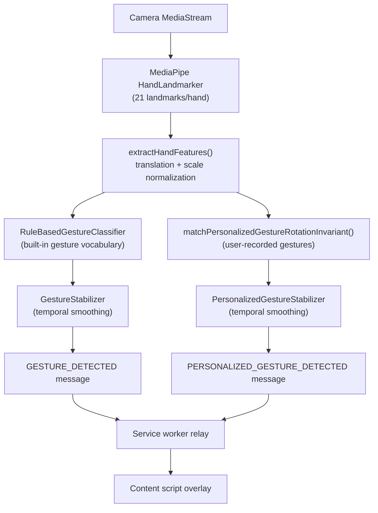
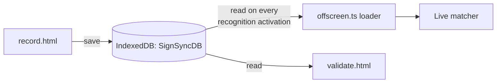
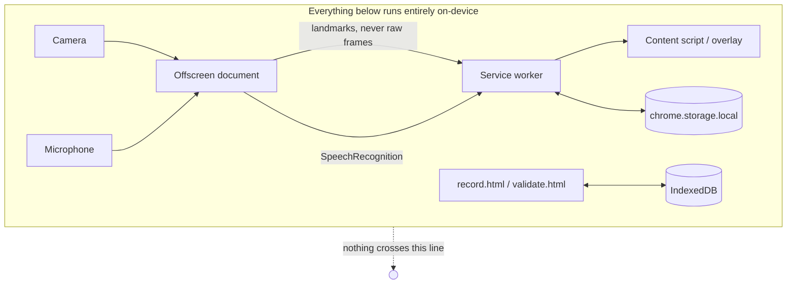

# Architecture

SignSync is a Chrome MV3 extension with no backend. Every capability — hand-landmark detection, gesture classification, personalized-gesture matching, speech recognition, translation, and storage — runs inside the browser, on the user's machine, using only extension-scoped APIs. This document explains how the extension's pieces fit together and why the boundaries are drawn where they are.

## 1. The MV3 surfaces

An MV3 extension isn't one program — it's several separately-lifecycled contexts that can only talk to each other through message passing. SignSync uses six:

| Surface | File | Responsibility |
|---|---|---|
| **Popup** | `src/popup/` | The toolbar UI: Dashboard, Onboarding, Settings. Opens and closes with every click — holds no state of its own beyond what it fetches on mount. |
| **Service worker** | `src/background/service-worker.ts` | The only long-lived (ish — MV3 can suspend it) context. Owns persisted state, relays every cross-context message, and manages the offscreen document's lifecycle. |
| **Content script** | `src/content/` | Injected into every page (`<all_urls>` — see §6). Renders the floating overlay and owns nothing else; it has no camera/mic access of its own. |
| **Offscreen document** | `src/offscreen/offscreen.ts` | The only place with a real DOM the service worker can drive — used because MediaPipe and `getUserMedia()` need one, and service workers don't have one. Owns the camera, the hand-tracking model, and the SpeechRecognition session. |
| **Record / Validate / Tutorials pages** | `src/record/`, `src/validate/`, `src/tutorials/` | Full extension pages (`chrome.tabs.create`), not popups — recording a gesture needs a stable, dismissible, full-sized window, not a 320px popup that closes on blur. |
| **Permission page** | `src/permission/` | A visible tab whose only job is to host the `getUserMedia()` prompt — the offscreen document is invisible and Chrome can't show a permission prompt there. |

Six surfaces, one shared brain: the service worker. No two of these run in the same JS realm, and none of them share memory — everything that crosses a boundary goes through `chrome.runtime.sendMessage` / `chrome.tabs.sendMessage`, typed by `SignSyncMessage` in `src/types/index.ts`.

## 2. Why MediaPipe runs in the offscreen document, not the content script

The obvious place to put camera + hand-tracking would seem to be the content script — it's already injected into the page. Two reasons that's wrong:

1. **Isolation.** A content script runs in the page's isolated world but is still subject to the page's own restrictions and lifecycle (the page can navigate, the tab can be backgrounded and throttled). A misbehaving or hostile page shouldn't be able to interfere with camera capture.
2. **One camera stream, many tabs.** SignSync's overlay can be present on multiple tabs at once. Camera/MediaPipe/hand-tracking needs to run exactly once, independent of which tab currently has focus — an offscreen document, owned by the service worker, is the one place MV3 gives you for that.

The camera `MediaStream` and the raw video frames **never leave the offscreen document** — not even the extracted landmark arrays cross into a message until they've already been reduced to a classification/match result. What actually gets sent across `chrome.runtime.sendMessage` per stable gesture is a small, typed payload (`GestureDetectedPayload` / `PersonalizedGestureDetectedPayload`): a label, confidence, and (for personalized gestures) an already-localized meaning string. This is deliberate — it keeps the message channel cheap, and it means no other context ever needs (or gets) raw biometric data.

## 3. The gesture pipeline

Two independent recognition paths run off the same per-frame landmarks, on the same ~120ms detection tick, inside `offscreen.ts`:

**Built-in path** (`ai/gestureClassifier.ts`): a small, fixed vocabulary of hand shapes recognized by deterministic geometric rules over normalized landmarks — no training, no model weights, fully inspectable.

**Personalized path** (`ai/personalizedGestureMatcher.ts` + `ai/personalizedGestureRotation.ts`): nearest-neighbor matching against a user's own recorded examples, in a rotation-invariant representation so a gesture recorded at one hand angle is still recognized at another. Entirely separate code, separate state, separate stabilizer — it never calls into, and is never called by, the built-in path. A frame can produce a built-in match, a personalized match, both, or neither.

**Why a stabilizer exists**: a single frame's classification is noisy — a hand mid-transition between two shapes can flicker between labels tick to tick. Both stabilizers require several consecutive frames to agree before they emit a message, and only emit *on the transition into* a new stable state, never once per frame. This is what keeps speech output from spamming the same word 8 times a second while a gesture is held.

## 4. Personalized gestures: record → store → recognize

- **Storage**: `services/personalizedGesturesDb.ts` owns a single IndexedDB database (`SignSyncDB`, version 1) with two object stores — `personalizedGestures` (metadata: name, default meaning, optional per-language meanings, enabled flag) and `gestureExamples` (one row per captured landmark snapshot, indexed by `gestureId`). Splitting metadata from examples matches the real one-to-many relationship and lets examples be added/removed without rewriting the parent record.
- **Freshness, not caching**: the offscreen document's `RefreshablePersonalizedGesturesLoader` re-fetches the full gesture list from IndexedDB on *every* recognition activation, not once per document lifetime — a gesture recorded in `record.html` while the overlay is already running becomes recognizable the next time recognition is turned on, without needing a full extension reload. The per-frame detection loop itself never touches IndexedDB directly; it only reads the loader's synchronous, already-fetched snapshot.
- **Resilience**: a failed reload never clears the previously-loaded list — a transient IndexedDB hiccup degrades to "using slightly stale data" rather than "personalized recognition silently stops working."
- **No hardcoded identities**: every gesture is looked up by whatever ID IndexedDB assigned it (`crypto.randomUUID()`), never a literal string baked into the pipeline — the set of recognizable gestures is entirely user-driven.

## 5. Multilingual support: presentation layer, not pipeline layer

The recognition pipeline is language-agnostic by construction — it operates on landmark geometry, never text. Localization happens strictly *after* a match is decided:

- **Built-in gestures**: `ai/gestureVocabulary.ts` maps a gesture label to a canonical English command string (unchanged, still what's sent in `GESTURE_DETECTED`). A separate, additive `getLocalizedGestureText()` in the content script re-maps that same label to the user's current interface language purely for display/speech — the offscreen/pipeline layer never needs to know what language is selected.
- **Personalized gestures**: each gesture can have an optional `localizedMeanings` map (`{"hi-IN": "...", "te-IN": "..."}`) alongside its always-present default English `meaning`. When a personalized gesture stabilizes, `offscreen.ts` resolves the correct string for the currently-selected language (falling back to English if no translation exists) *before* the message is sent — so the overlay, speech synthesis, and conversation history all agree on the same, already-correct text without re-deriving it themselves.
- **Interface, captions, and speech share one language setting.** This was a deliberate scope decision, not an oversight: splitting them into three independent pickers would add real state-management complexity for a use case (captioning in a different language than the UI) that wasn't a stated requirement.

## 6. Live captions

The offscreen document owns a single `SpeechRecognition` instance, configured with `.lang` set from the selected interface language and restarted (not just reconfigured) if that language changes while captions are active, since a running recognition session doesn't pick up a new `.lang` on its own. Failure modes are classified and surfaced as plain-language overlay messages rather than raw `SpeechRecognitionErrorEvent` codes — distinguishing "this browser has no SpeechRecognition support," "microphone access was denied or lost," and "this specific language isn't supported," each with different, accurate wording.

## 7. Conversation history

A small, session-only, in-memory list (`ConversationEntry[]`) in the content script, populated from all three live event sources (built-in gesture, personalized gesture, finalized caption) through pure, independently-tested builder functions. It is intentionally **not** persisted to `chrome.storage.local` — the PRD describes conversation history as something the extension "can optionally maintain," and the overlay already treats every re-enable as a fresh session (gesture display and captions both reset), so persisting only the history log while everything else resets would be an inconsistent, undocumented special case.

## 8. Privacy boundary, in one picture

There is no backend and no network call anywhere in the codebase (verified by repo-wide search, not merely assumed). The one caveat that can't be verified from source: `SpeechRecognition` in Chrome may, depending on Chrome's own implementation, process audio through a Google speech-recognition service rather than fully on-device — this is standard Web Speech API behavior across browsers, not something SignSync controls or can bypass, and is called out explicitly in `PRIVACY.md`.

## 9. Why this codebase separates concerns the way it does

- **Recognition vs. presentation**: keeping `ai/*` free of any language/formatting concerns means the matcher/classifier logic can be reasoned about (and tested) purely in terms of geometry, with zero risk that a UI change accidentally perturbs a recognition threshold.
- **Domain validation vs. raw storage**: `shared/personalizedGestures.ts` (structural validation, sanitization) is deliberately separate from `services/personalizedGesturesDb.ts` (raw IndexedDB CRUD) — one bad stored record can never crash a reader, and the validation rules are unit-testable without touching IndexedDB at all.
- **Pure logic vs. React**: this project's test suite covers `.ts` modules, not `.tsx` components (see `docs/testing.md`) — so UI logic that needs test coverage (form validation, conversation-entry construction, accessibility class derivation) is deliberately extracted into plain functions first, leaving only rendering in the untested JSX layer.
